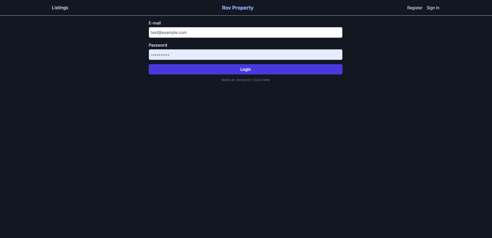

<p align="center">
  <a href="https://laravel.com" target="_blank">
    
  </a>
</p>

<h1 align="center">rov-property</h1>

<p align="center">
  A starter project using Laravel 11 + Inertia.js + Vue 3 + Tailwind CSS to build modern Single Page Applications.
</p>

---

## 🖼️ Screenshot



---

## 🚀 Key Features

-   Laravel 11 with Inertia.js
-   Vue 3 with Composition API
-   Tailwind CSS for styling
-   Authentication and user management
-   Property listings CRUD with image support
-   File uploads and notification system
-   Price offer feature (Make Offer)
-   Docker support for local development

## 📦 Requirements

-   PHP 8.2 or higher
-   Node.js v18+
-   Composer
-   SQLite / MySQL / PostgreSQL
-   Docker (optional)

## ⚙️ Installation

```bash
# 1. Clone the repository
git clone https://github.com/username/laravue.git
cd laravue

# 2. Install PHP & JS dependencies
composer install
npm install

# 3. Setup .env and generate app key
cp .env.example .env
php artisan key:generate

# 4. Run migrations and seeders
php artisan migrate --seed

# 5. Start development servers
php artisan serve
npm run dev
```
